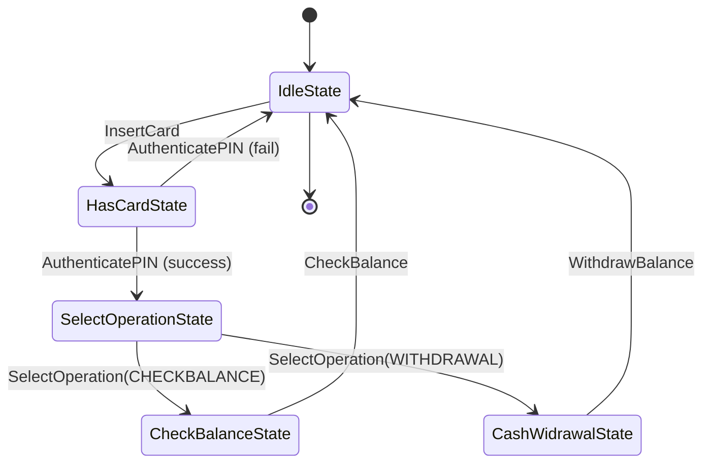
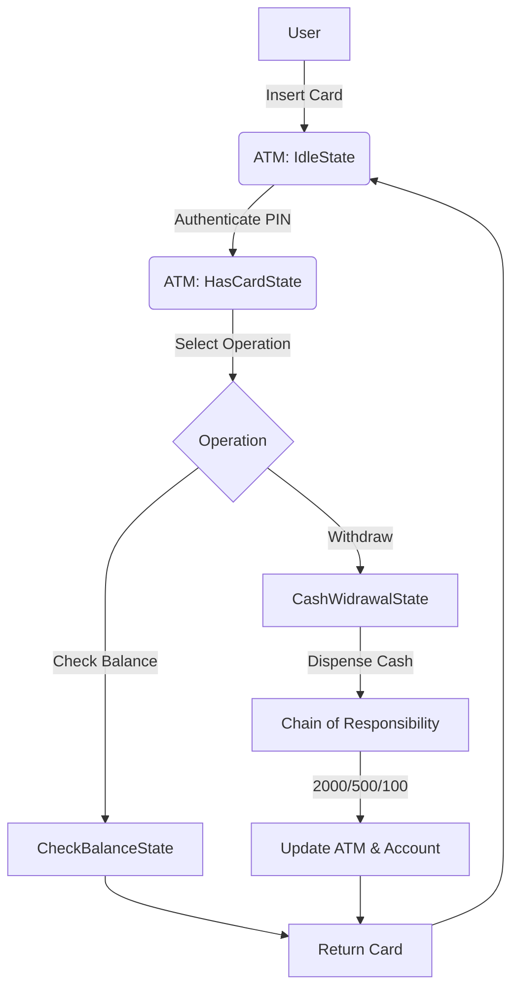

# ATM Machine LLD (Low Level Design)

This project demonstrates a simple ATM machine simulation using C++ and Object-Oriented Design Patterns.

## Design Patterns Used

- **State Pattern**: Used to manage the different states of the ATM (Idle, HasCard, SelectOperation, CheckBalance, CashWithdrawal). Each state is encapsulated in a class, allowing the ATM to change its behavior based on its current state.
- **Chain of Responsibility Pattern**: Used for the cash dispensing logic. Each handler (2000, 500, 100 note handler) is responsible for dispensing a specific denomination and passes the remaining amount to the next handler in the chain.

## Design Patterns Used

- **State Pattern**: The ATM's behavior changes based on its current state (Idle, HasCard, SelectOperation, CheckBalance, CashWithdrawal). Each state is represented by a class that implements the `ATMState` interface, encapsulating the logic for that state. This makes it easy to add new states or modify existing ones without affecting other parts of the code.
- **Chain of Responsibility Pattern**: The cash dispensing logic is implemented as a chain of handlers (`TwoThousandCashHandler`, `FiveHundredCashHandler`, `HundredCashHandler`). Each handler is responsible for dispensing a specific denomination and passes the remaining amount to the next handler in the chain. This allows flexible and extensible handling of different denominations.

## ATM LLD Functionality

The ATM LLD (Low Level Design) provides the following core functionalities:

- **Card Handling**: Users can insert their card, which is validated by the ATM. The card is associated with a bank account and a PIN.
- **PIN Authentication**: After inserting the card, the user must enter the correct PIN to proceed. Incorrect PINs are handled gracefully, and the card is returned if authentication fails.
- **Operation Selection**: Once authenticated, users can select from available operations such as checking their balance or withdrawing cash.
- **Balance Inquiry**: Users can check their current account balance. The ATM displays the balance and returns the card.
- **Cash Withdrawal**: Users can withdraw cash if both their account and the ATM have sufficient funds. The withdrawal amount is dispensed using available denominations, and the system ensures that the correct number of notes is deducted from the ATM.
- **Denomination Management**: The ATM tracks the number of notes for each denomination (2000, 500, 100) and only dispenses cash if the required denominations are available.
- **Error Handling**: The system checks for insufficient funds in both the user's account and the ATM, as well as for unavailable denominations. Appropriate messages are displayed for each scenario.
- **User and Account Abstraction**: The design separates user, card, and account logic, making the system modular and easy to extend.

## Features
- Card insertion and PIN authentication
- Balance check and cash withdrawal
- ATM cash management with denominations
- User and account abstraction

---

## UML Flow Diagram

## Brief Explanation

- **ATM States**: The ATM transitions between states (Idle, HasCard, SelectOperation, etc.) using the State pattern. Each state handles only the operations valid for that state.
- **Cash Dispensing**: The Chain of Responsibility pattern is used to break down the withdrawal amount into available denominations (2000, 500, 100). Each handler checks if it can dispense its denomination and passes the remainder to the next handler.
- **User Flow**: The user inserts a card, authenticates with a PIN, selects an operation (check balance or withdraw), and the ATM processes the request accordingly.
- **Error Handling**: The system checks for sufficient balance in both the user's account and the ATM, and for available denominations.

---

> **Note:** This is a simple simulation for learning purposes and does not cover all real-world ATM scenarios.
