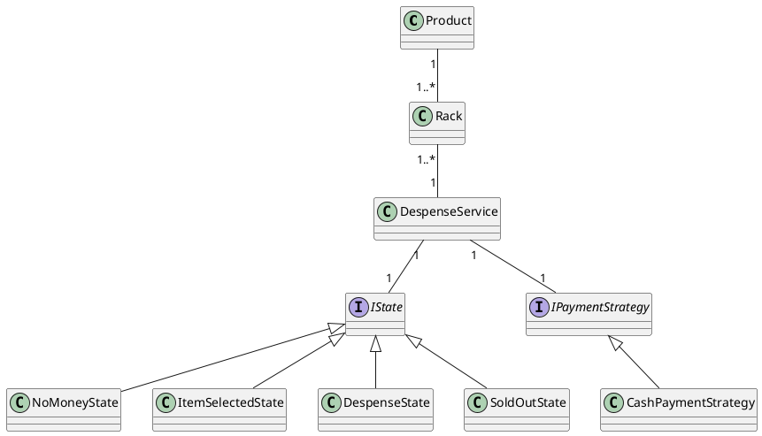

# Vending Machine (C++)

## Overview

This project implements a Vending Machine in C++ using the **State** and **Strategy** design patterns.
- **State Pattern:** Manages the machine’s behavior based on its current state (e.g., NoMoney, ItemSelected, Dispense, SoldOut).
- **Strategy Pattern:** Handles payment methods, allowing easy extension for new payment strategies.

## Features

- Product selection and payment
- Stock management for each rack
- Multiple states: NoMoney, ItemSelected, Dispense, SoldOut
- Cash payment strategy (extensible for other payment types)
- Test harness with various scenarios

## Structure

- `Product` and `Rack`: Represent items and their storage.
- `DespenseService`: Core vending machine logic, manages racks, state, and payment.
- `IState` and concrete states: Encapsulate state-specific behavior.
- `IPaymentStrategy` and `CashPaymentStrategy`: Encapsulate payment logic.

## Flow

1. **User selects a product** (rack number).
2. **State transitions** to `ItemSelectedState` if stock is available.
3. **User makes payment** (amount).
4. **Payment strategy** (e.g., `CashPaymentStrategy`) processes payment.
5. If payment is successful, **state transitions** to `DespenseState` and product is dispensed.
6. If stock is depleted, **state transitions** to `SoldOutState`.
7. **Restocking** transitions back to `NoMoneyState`.

## UML Diagram

## How to Run

1. Compile `VendingMachine1.cpp` with a C++ compiler.
2. Run the executable to see the test scenarios.

## Extending

- Add new payment strategies by implementing `IPaymentStrategy`.
- Add new states by extending `IState`.
